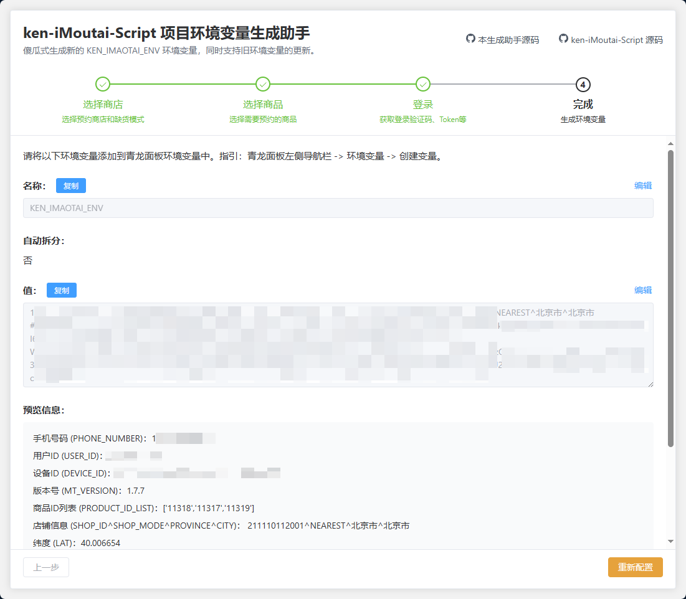

# iMoutaiEnvGenerator

## 项目描述

iMoutaiEnvGenerator 是一个专为 [ken-iMoutai-Script](https://github.com/AkenClub/ken-iMoutai-Script) 项目设计的配套前端工具。其主要目的是帮助用户快速生成脚本运行所需的青龙面板环境变量 `KEN_IMAOTAI_ENV`，大大简化了变量配置过程，提升用户体验。

用户只需根据提示依次填写手机号、验证码等必要信息，工具将实时生成对应的环境变量，并提供一键复制功能，方便用户直接粘贴到青龙面板。

## 功能特点

- **表单输入**：简单易用的表单界面，用户只需输入或选择必要信息。
- **实时生成**：根据用户输入动态生成 `KEN_IMAOTAI_ENV` 环境变量字符串。
- **一键复制**：支持一键复制生成的环境变量到剪贴板。
- **用户友好**：提供清晰的使用步骤和脚本说明。

## 使用截图




## 本地使用方法

1. **拉取代码并启动项目**：

   ```
   git clone https://github.com/AkenClub/iMoutaiEnvGenerator.git
   cd iMoutaiEnvGenerator
   yarn install
   yarn dev
   ```

2. **填写表单**：

   - 打开浏览器，访问 `http://localhost:12999`。
   - 根据表单提示输入信息。

3. **生成环境变量**：

   - 确认填写无误后，点击 "生成环境变量" 按钮。
   - 复制生成的 `KEN_IMAOTAI_ENV`。

4. **粘贴到青龙面板**：

   - 登录青龙面板，进入环境变量配置页面。
   - 新增变量 `KEN_IMAOTAI_ENV`，将生成的字符串粘贴进去，保存即可。

## Docker 构建使用方法

直接集成了前后端，直接启动即可。前端地址为 `http://localhost:12999`。

```
<!-- 构建镜像 -->
docker build -t imaotai-env-generator .
<!-- 启动容器 -->
docker run -d --name imoutai-env-generator -p 12999:12999 imoutai-env-generator
```

## 注意事项

1. **关于 User-Agent 设置问题**
   - 现象：浏览器控制台可能出现 `Refused to set unsafe header "User-Agent"` 警告。
   - 原因：这是由浏览器的安全策略导致的，前端无法直接修改某些保护的请求头，前端的 axios 配置的 User-Agent 会被浏览器忽略。
   - 解决方案：
     - 推荐使用上述 Docker 构建。
     - 也可自行使用 node 启动项目，入口文件为 `server/app.js`。先执行打包命令 `yarn build`，生成 `dist` 目录，然后执行 `node server/app.js` 启动项目。
     - 此警告不会影响程序正常运行，可以忽略，但是为了避免在茅台 APP 接口中出现浏览器的 UA，建议在 `server/app.js` 中设置 User-Agent。

## 免责声明

本项目涉及抓取接口数据，仅用于学习和交流目的。请注意以下几点：

1. **合法性和合规性**： 使用本项目时，请确保遵守所有相关法律法规以及服务条款。本项目的使用可能涉及到法律风险，用户需要对使用本项目的行为负责。
2. **数据隐私**： 本项目涉及对接口数据的抓取，用户需自行保证对其账号、数据和隐私的保护，避免泄露敏感信息。
3. **风险提示**： 由于抓取接口数据可能会受到系统限制或变更，本项目的正常运行和功能实现无法得到保证。使用本项目的风险由用户自行承担。
4. **第三方服务**： 本项目的部分功能可能依赖于第三方服务或接口，这些服务的变更或不可用可能会影响脚本的正常工作。
5. **学习和交流**： 本项目仅用于学习和交流目的，旨在帮助用户了解接口抓取和自动化处理的技术。请勿用于商业用途或其他非法活动。
6. **责任声明**： 本项目作者不对因使用本项目而产生的任何直接或间接损失负责。请用户在使用前充分理解相关风险，并确保合法合规使用。

## 许可证

本项目使用 [Apache-2.0 许可证](LICENSE) 进行许可。有关更多详细信息，请参阅 `LICENSE` 文件。
