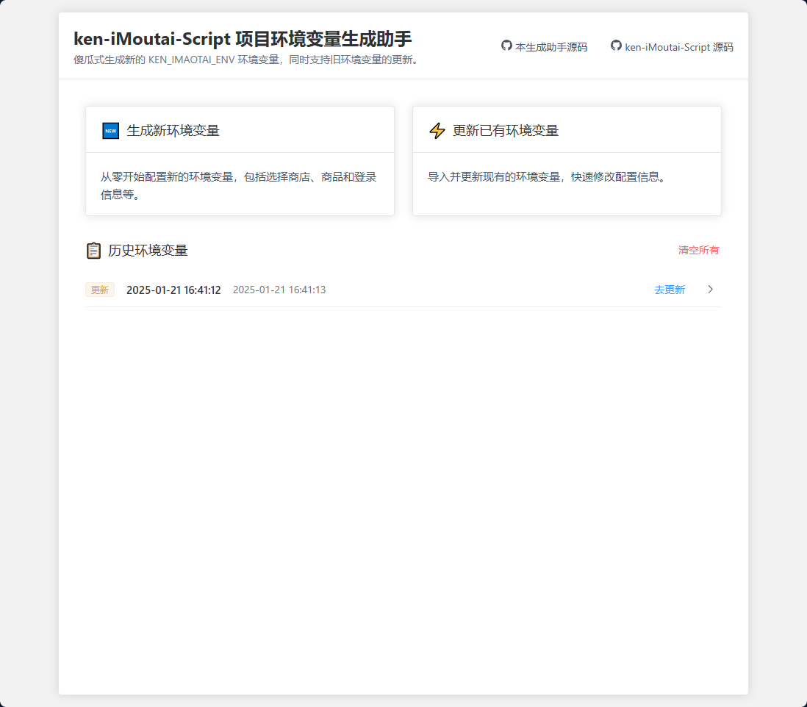

# iMoutaiEnvGenerator

## 项目描述

iMoutaiEnvGenerator 是一个专为 [ken-iMoutai-Script](https://github.com/AkenClub/ken-iMoutai-Script) 项目设计的配套前端工具。其主要目的是帮助用户快速生成脚本运行所需的青龙面板环境变量 `KEN_IMAOTAI_ENV`，大大简化了变量配置过程，提升用户体验。

用户只需根据提示依次填写手机号、验证码等必要信息，工具将实时生成对应的环境变量，并提供一键复制功能，方便用户直接粘贴到青龙面板。

## 功能特点

- **表单输入**：简单易用的表单界面，用户只需输入或选择必要信息。
- **实时生成**：根据用户输入动态生成 `KEN_IMAOTAI_ENV` 环境变量字符串。
- **一键复制**：支持一键复制生成的环境变量到剪贴板。
- **用户友好**：提供清晰的使用步骤和脚本说明。
- **历史记录**：支持保存和更新历史环境变量记录。

## 使用截图



<details>

<summary>更多截图</summary>


</details>

## 推荐 Docker 一行命令部署

部署成功后，访问 `http://localhost:12999` 即可使用。

```
docker run -d --name imoutai-env-generator -p 12999:12999 ppken/imaotai-env-generator
```

## 本地使用方法

1. **拉取代码并启动项目**：

   ```
   git clone https://github.com/AkenClub/iMoutaiEnvGenerator.git
   cd iMoutaiEnvGenerator
   yarn install
   yarn dev
   ```

2. **填写表单**：

   - 打开浏览器，访问 `http://localhost:12999`。
   - 根据表单提示输入信息。

3. **生成环境变量**：

   - 确认填写无误后，点击 "生成环境变量" 按钮。
   - 复制生成的 `KEN_IMAOTAI_ENV`。

4. **粘贴到青龙面板**：

   - 登录青龙面板，进入环境变量配置页面。
   - 新增变量 `KEN_IMAOTAI_ENV`，将生成的字符串粘贴进去，保存即可。

## Docker 构建使用方法

直接集成了前后端，直接启动即可。前端地址为 `http://localhost:12999`。

```
<!-- 构建镜像 -->
docker build -t imaotai-env-generator .
<!-- 启动容器 -->
docker run -d --name imaotai-env-generator -p 12999:12999 imaotai-env-generator
```

## 注意事项

1. **关于 User-Agent 设置问题**
   - 现象：浏览器控制台可能出现 `Refused to set unsafe header "User-Agent"` 警告。
   - 原因：这是由浏览器的安全策略导致的，前端无法直接修改某些保护的请求头，前端的 axios 配置的 User-Agent 会被浏览器忽略。
   - 解决方案：
     - 推荐使用上述 Docker 构建。
     - 也可自行使用 node 启动项目，入口文件为 `server/app.js`。先执行打包命令 `yarn build`，生成 `dist` 目录，然后执行 `node server/app.js` 启动项目。
     - 此警告不会影响程序正常运行，可以忽略，但是为了避免在茅台 APP 接口中出现浏览器的 UA，建议在 `server/app.js` 中设置 User-Agent。

## CloudFlare 部署方式

<details>
<summary>
点击展开
</summary>

本项目可以方便地部署到 Cloudflare Pages，利用其全球 CDN 和 Serverless Functions (用于 API 代理)。

### 部署步骤

1.  **代码准备**:

    - 确保您的代码已推送到 GitHub 或 GitLab 仓库。
    - 项目中已包含 `functions` 目录，其中包含用于 API 代理的 Cloudflare Pages Functions (`functions/appleapi/[[path]].js`, `functions/mtstaticapi/[[path]].js`, `functions/mtappapi/[[path]].js`)。

2.  **在 Cloudflare Pages 中创建项目**:

    - 登录到您的 Cloudflare 仪表板。
    - 导航到 "Workers & Pages"。
    - 点击 "Create application"，然后选择 "Pages" 标签页。
    - 选择 "Connect to Git"，并授权 Cloudflare 访问您的代码仓库。
    - 选择您要部署的仓库和生产分支 (例如 `main`)。

3.  **配置构建设置**:

    - **Framework preset**: 选择 `无`。
    - **Build command**: 设置为 `yarn build` (或 `npm run build`，根据您的习惯)。
    - **Build output directory**: 确保设置为 `dist`。
    - **Root directory**: 保持默认或根据您的项目结构设置 (通常是仓库根目录)。
    - **注意**: 如果您的 Cloudflare Pages 项目面板提示非机密环境变量通过 `wrangler.toml` 文件进行管理，请确保在项目根目录的 `wrangler.toml` 文件中定义这些变量 (参考下方"Wrangler 配置文件"部分)。机密变量（Secrets）仍应通过 Cloudflare 仪表板管理。

4.  **保存并部署**:
    - 点击 "Save and Deploy"。Cloudflare Pages 将拉取代码，执行构建命令，并将 `dist` 目录的内容和 `functions` 目录下的函数部署到其全球网络。
    - 部署完成后，您会得到一个 `*.pages.dev` 的子域名。您也可以后续配置自定义域名。
    - 您的 API 请求 (例如 `/appleapi/...`) 将会自动被路由到相应的 Pages Function 进行代理。

### 本地开发和调试 (使用 Wrangler)

Cloudflare Wrangler CLI 允许您在本地模拟 Cloudflare Pages 环境，包括静态资源服务和 Functions。

1.  **安装 Wrangler (如果尚未安装)**:

    - 推荐使用 npx (无需全局安装): `npx wrangler ...`
    - 或全局安装: `npm install -g wrangler` / `yarn global add wrangler`

2.  **准备本地环境变量**:

    - 在项目根目录创建一个 `.dev.vars` 文件 (如果不存在)。
    - 添加本地开发时 Functions 需要的环境变量。此文件**不应**提交到 Git。
      ```ini
      # .dev.vars
      VITE_APP_STORE_URL="https://apps.apple.com"
      VITE_MT_SHOP_STATIC_URL="https://static.moutai519.com.cn"
      VITE_MT_APP_API_URL="https://app.moutai519.com.cn"
      # NODE_VERSION="22" # 如果本地测试也需要特定版本
      ```
    - 确保 `.dev.vars` 已被添加到 `.gitignore` 文件中。

3.  **Wrangler 配置文件 (`wrangler.toml`)**:

    - 项目中应包含一个 `wrangler.toml` 文件，基本配置如下：

      ```toml
      name = "imaotai-env-generator" # 与 Cloudflare Pages 项目名称一致
      compatibility_date = "2025-05-05" # 使用一个较新的日期
      pages_build_output_dir = "dist"

      # 定义环境变量，供 Pages Functions 在本地开发和生产环境中使用
      # 如果 Cloudflare Pages 面板指示环境变量由 wrangler.toml 管理，
      # 这里的 [vars] 部分将用于生产部署。
      [vars]
      VITE_APP_STORE_URL = "https://apps.apple.com"
      VITE_MT_SHOP_STATIC_URL = "https://static.moutai519.com.cn"
      VITE_MT_APP_API_URL = "https://app.moutai519.com.cn"
      # NODE_VERSION = "18" # 如果您的 Functions 需要特定 Node.js 版本 (示例)
      ```

    - 此文件指导 Wrangler 如何在本地运行您的 Pages 项目。如果 Cloudflare 指示，此文件中的 `[vars]` 也会用于生产环境的变量配置。
    - **重要**: 如果您在 `wrangler.toml` 中定义了这些变量，请确保将此文件提交到您的 Git 仓库，以便 Cloudflare Pages 在部署时能够读取这些配置。

4.  **本地调试流程**:

    - **方式一: 纯前端开发 (Vite Dev Server)**

      - 运行: `yarn dev` (或 `npm run dev`)
      - Vite 开发服务器将启动，提供热模块替换 (HMR)。API 请求将通过 `vite.config.ts` 中的 `server.proxy` 配置进行代理。
      - **注意**: 此模式不执行 `functions/` 目录下的 Cloudflare Pages Functions。

    - **方式二: 完整 Pages 环境模拟 (Wrangler)**
      1.  **构建前端**: `yarn build` (或 `npm run build`)，生成 `dist/` 目录。
      2.  **启动 Wrangler**: `npx wrangler pages dev`
          - Wrangler 会从 `dist` 目录提供静态文件，并运行 `functions/` 目录下的 Functions。
          - 环境变量将从 `.dev.vars` 文件加载。
          - 通常服务会运行在 `http://localhost:8788`。
      3.  在浏览器中访问 Wrangler 提供的地址进行测试。API 调用将由本地运行的 Pages Functions 处理。

### 注意事项

- 部署到 Cloudflare Pages 后，原先项目中的 `server/` 目录 (包含 `app.js` 和 `package.json`) 和 `Dockerfile` 将不再需要，因为其功能已被 Cloudflare Pages 的静态资源服务和 Pages Functions 替代。
- `vite.config.ts` 中的 `server.proxy` 配置仅用于本地 Vite 开发服务器，不影响 Cloudflare Pages 的生产部署。
</details>

## 免责声明

本项目涉及抓取接口数据，仅用于学习和交流目的。请注意以下几点：

1. **合法性和合规性**： 使用本项目时，请确保遵守所有相关法律法规以及服务条款。本项目的使用可能涉及到法律风险，用户需要对使用本项目的行为负责。
2. **数据隐私**： 本项目涉及对接口数据的抓取，用户需自行保证对其账号、数据和隐私的保护，避免泄露敏感信息。
3. **风险提示**： 由于抓取接口数据可能会受到系统限制或变更，本项目的正常运行和功能实现无法得到保证。使用本项目的风险由用户自行承担。
4. **第三方服务**： 本项目的部分功能可能依赖于第三方服务或接口，这些服务的变更或不可用可能会影响脚本的正常工作。
5. **学习和交流**： 本项目仅用于学习和交流目的，旨在帮助用户了解接口抓取和自动化处理的技术。请勿用于商业用途或其他非法活动。
6. **责任声明**： 本项目作者不对因使用本项目而产生的任何直接或间接损失负责。请用户在使用前充分理解相关风险，并确保合法合规使用。

## 许可证

本项目使用 [Apache-2.0 许可证](LICENSE) 进行许可。有关更多详细信息，请参阅 `LICENSE` 文件。
